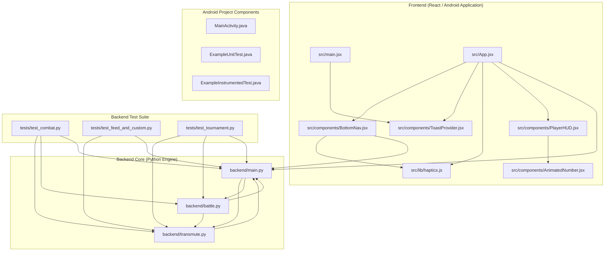

# Pocket Alchemy - System Architecture Documentation

This document outlines the architecture, component hierarchy, and dependency structure of the codebase derived directly from the application dependency graph.

---

## 1. High-Level Architecture Overview

The system is structured as a full-stack application comprising a **Frontend Application** (React with Vite, paired with Capacitor Android native integration) and a **Backend Service** (Python application managing card creation/transmutation, battles, campaign tracking, agents, and WebSockets).

```
+-----------------------------------------------------------------------+
|                            Frontend Layer                             |
|  (React / Vite Components, HUD, Bottom Nav, Haptics, Android Native) |
+-----------------------------------+-----------------------------------+
                                    |
                                    v (HTTP / WebSockets API)
+-----------------------------------------------------------------------+
|                            Backend Layer                              |
|   (main.py REST API & WebSockets, transmute.py Engine, battle.py)     |
+-----------------------------------+-----------------------------------+
                                    |
                                    v
+-----------------------------------------------------------------------+
|                             Test Suite                                |
|         (test_combat.py, test_feed_and_custom.py, test_tournament.py) |
+-----------------------------------------------------------------------+
```

---

## 2. Component Breakdowns & Entities

### 2.1. Frontend Architecture (`frontend/`)

#### Build & Tooling Configuration
- **`frontend/eslint.config.js`**: ESLint configuration file.
- **`frontend/vite.config.js`**: Vite bundler configuration file.

#### Presentation & UI Layer
- **`frontend/src/main.jsx`**: Root entry point rendering `ToastProvider`.
- **`frontend/src/App.jsx`**: Main application container component.
  - *Entities*: `App`, `AlchemicalPlaceholder`, `TradingCard`
  - *Dependencies*: `ToastProvider.jsx`, `BottomNav.jsx`, `PlayerHUD.jsx`, `haptics.js`, `backend/main.py`
- **`frontend/src/components/PlayerHUD.jsx`**: Displays user rank, XP progress, and stats.
  - *Entities*: `PlayerHUD`, `getRank`, `getXpProgress`
  - *Dependencies*: `AnimatedNumber.jsx`
- **`frontend/src/components/BottomNav.jsx`**: Bottom navigation component.
  - *Entities*: `BottomNav`
  - *Dependencies*: `haptics.js`, `backend/main.py`
- **`frontend/src/components/AnimatedNumber.jsx`**: Component for animated numeric displays.
  - *Entities*: `AnimatedNumber`
- **`frontend/src/components/ToastProvider.jsx`**: Toast notifications context provider.
  - *Entities*: `ToastProvider`

#### Utilities & Native Platform Layer
- **`frontend/src/lib/haptics.js`**: Haptic feedback utility handler.
  - *Entities*: `haptics.js`
- **Android Integration**:
  - `frontend/android/app/src/main/java/com/pocketalchemy/app/MainActivity.java` (`MainActivity`)
  - `frontend/android/app/src/test/java/com/getcapacitor/myapp/ExampleUnitTest.java` (`ExampleUnitTest`)
  - `frontend/android/app/src/androidTest/java/com/getcapacitor/myapp/ExampleInstrumentedTest.java` (`ExampleInstrumentedTest`)

---

### 2.2. Backend Architecture (`backend/`)

#### Primary Controller & API Router (`backend/main.py`)
Serves endpoints for card management, battles, campaign progression, AI agents, advisor chat, and WebSocket channels.
- **Entities**:
  - **Database & Services**: `AlchemicalDB`, `upload_to_gcs`, `check_safe_search`
  - **Request / Data Models**: `BattleCreateRequest`, `BattleJoinRequest`, `CampaignFightRequest`, `FuseRequest`, `HintRequest`, `AgentPlayRequest`, `GeminiAgentDecision`, `AdvisorChatRequest`
  - **Handlers & Endpoints**:
    - Agent & User Management: `get_or_create_agent`
    - Card Operations: `get_cards`, `transmute`, `fuse`, `get_uniqueness_dashboard`, `get_today_feed`
    - Battle & Campaign Ops: `create_battle`, `join_battle`, `campaign_fight`, `get_campaign_status`, `battle_agent_play`, `get_battle_hint`
    - System & Websocket: `health_check`, `websocket_room`, `get_current_daily_quest`, `advisor_chat`, `read_index`
- **Dependencies**: `backend/transmute.py`, `backend/battle.py`

#### Card & Transmutation Engine (`backend/transmute.py`)
Handles card definitions, stats balancing, image transmutations, audio generation, and card fusing logic.
- **Entities**:
  - Data Models: `GeminiGameCard`, `CardStats`, `GameCard`
  - Logic Functions: `balance_stats`, `save_pcm_as_wav`, `transmute_image_to_card`, `fuse_cards`
- **Dependencies**: `backend/main.py`

#### Combat & Battle Engine (`backend/battle.py`)
Executes elemental mechanics, combat calculations, fighter state management, and post-match analysis.
- **Entities**:
  - `get_element_multiplier`
  - `ActiveFighter`
  - `generate_post_match_analysis`
  - `BattleSession`
- **Dependencies**: `backend/transmute.py`, `backend/main.py`

---

### 2.3. Test Suite (`backend/tests/`)

- **`backend/tests/test_combat.py`**:
  - *Tests*: `test_balance_stats_exact`, `test_balance_stats_scaling`, `test_balance_stats_boundaries`, `test_element_multipliers`, `test_active_fighter_shielding`, `test_active_fighter_healing`, `test_battle_round_resolution_pve`, `test_battle_round_resolution_pvp`
  - *Dependencies*: `backend/transmute.py`, `backend/battle.py`, `backend/main.py`
- **`backend/tests/test_feed_and_custom.py`**:
  - *Tests*: `test_today_feed_endpoint`, `test_create_battle_with_custom_opponent`, `test_user_segregation_local_db`, `test_battle_agent_play_endpoint`
  - *Dependencies*: `backend/transmute.py`, `backend/main.py`
- **`backend/tests/test_tournament.py`**:
  - *Tests*: `test_tournament_owner_and_registration`, `test_tournament_owner_transfer`, `test_tournament_simulation_round_robin`
  - *Dependencies*: `backend/transmute.py`, `backend/battle.py`, `backend/main.py`

---

## 3. Dependency Relationship Diagram

The following Mermaid.js diagram illustrates all explicit relationships and dependencies across backend modules, frontend components, and tests.



---

## 4. Architectural Highlights & Patterns

1. **Tight Coupling between Main and Core Engines**:
   - `backend/main.py`, `backend/transmute.py`, and `backend/battle.py` maintain cyclic references. `main.py` calls transmutation and battle routines, while `transmute.py` and `battle.py` rely on `main.py` for state or model references.
2. **Modular Frontend Presentation**:
   - Visual feedback is strictly segregated across dedicated UI components (`PlayerHUD.jsx`, `AnimatedNumber.jsx`, `ToastProvider.jsx`).
   - `haptics.js` provides centralized control for device interaction calls consumed by `App.jsx` and `BottomNav.jsx`.
3. **Comprehensive Backend Test Coverage**:
   - The test modules (`test_combat.py`, `test_feed_and_custom.py`, `test_tournament.py`) directly validate core logic across card balancing, user feed behavior, custom battles, user segregation in `AlchemicalDB`, and tournament simulations.